# 墨西哥城圣诞游，"乱"只是你的传说

一家四口，2018圣诞期间，自由行走在据说北美最乱的墨西哥城 。\
\
朋友圈发帖后，N多朋友心潮起伏，摩拳擦掌，"蠢蠢欲动"。为给更多爱旅游更爱"冒险"的朋友提供信息，特整理成"合订本"，供您参考。但是，只有相同的景点，没有相同的经历，出发前务必请您做好功课。\
\
现在，就从大家普遍关心的三个问题开始，让我们一步步走进这座既古老，又现代，既有历史传统，又有灿烂文化的世界名城。  

## 墨西哥人民热烈欢迎你吗？  

"是的"，热情友好的墨西哥人民，欢迎来自世界各地的客人。\
\
我们到来，正值圣诞节期间。从机场的边检，到执勤的警察，酒店的前台，商店的员工，都春风满面，笑意盈盈，让我们处处感受到"墨城欢迎你"。\
\
逛店时，一种陌生的填taco的食材引起全家的兴趣。

我看像五花肉，女儿说生鱼片。店员热情解释了半天，我们一句没懂，她说西班牙语。这时，一位当地的中年女性刚好买完，坚持请我们品尝。是羊腱子，很美味。她的友善，更暖心。\
\
夜晚步行到宪法广场 (The Zócalo)，眼前流光溢彩，一派欢乐祥和的景象。\
\
图：宪法广场夜景

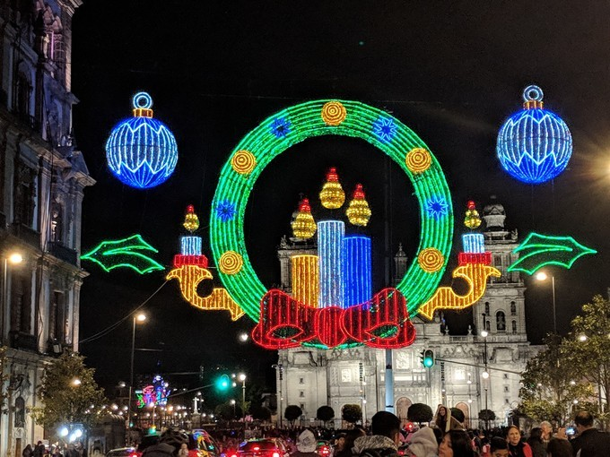 \  

著名景点日月金字塔离墨城约有一小时车程。这条旅游线路，几年前，连续发生多起武装暴徒设路障抢劫游客事件，造成极坏的国际影响。墨政府之后采取措施，加大力度，严打犯罪团伙。\
\
我们乘Bus前往金字塔时，在高速公路遇到巡逻的军警，分乘两辆车，全副武装，荷枪实弹。我的小心肝为之一颤，不过说时迟，那时快，发朋友圈的冲动让我不顾一切扑到窗前，"咔嚓"抢拍到一张照片。\
\
回来路上，Bus又被拦下，跳上三名枪手，手持冲锋枪或手枪，身穿防弹背心。虽然黑色制服上写着醒目的黄字
"Policia"，我小心肝又颤一下，难道车上有逃犯？走在最前面的嘴里不停喊话，神情像在说"缴枪不杀"。走在最后面的手举摄像机，对所有人一通猛拍。此处没照片，不敢和他对拍。\
\
沿途碰上这两件事，我是应该觉得安全，还是不安全？\
\
但旅游景点的安全是必须的。历史中心区更是安全得没一点悬念。入夜的街上，人头攒动，摩肩接踵，像春节赶庙会，车多得把大街小巷堵得一塌糊涂。\
\
晚上8点多，一家人步行到据说是地球最正宗的墨西哥Churro
店，排队40多分钟，买到 Churros .
味道有点像油条，但是酥的，甜中带点咸，裹一层 cinnamon
粉，再蘸巧克力酱，香甜可口！\
\
我们买12根。上中学的儿子看大师傅忙得片刻不停，就在瓶子里放了点小费，结果大师傅给他袋子里多装了好几根。人心换人心啊。\
\
图1，巡逻的军警\
图2，大师傅在炸 Churros\
图3，店外排起长队

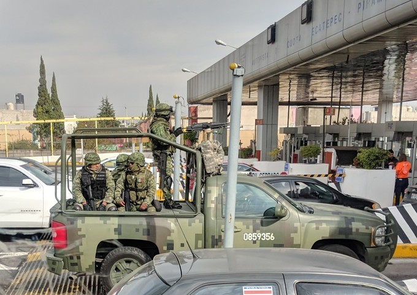

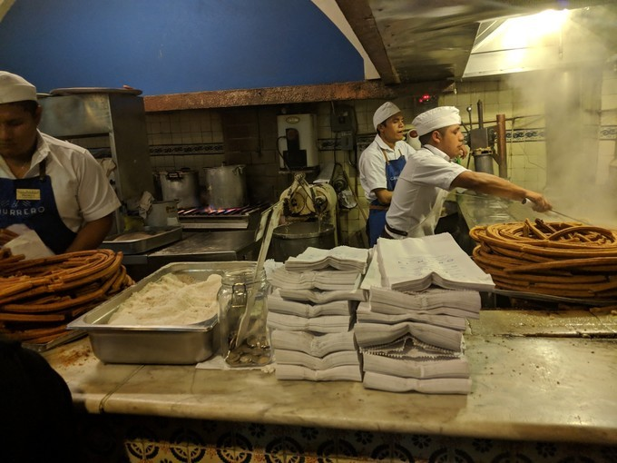

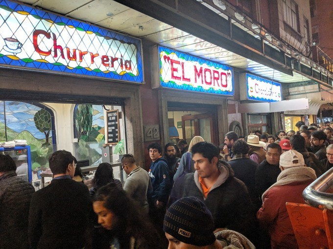   

## 墨城的冬天很热吗，或很冷？

正确答案：有时热，有时冷。有人热，有人冷。\
\
墨西哥属中美州，按说应该比美国最南端还热。\
\
但它地处高原，所以气温不高，这个季节也就华氏70多度，约合摄氏21°。\
\
可它日照强烈，所以身体感觉有80度。\
\
但太阳一旦下山，气温马上能低到53度，相当于一瓶二锅头的度数，正好提醒我们来口墨西哥国酒"龙舌兰"。\
\
所以概括起来，墨城冬天一日两季。\
\
但即使同一时间，同一地点，穿衣打扮也因人而异。穿羽绒服的不嫌热，穿T恤短裤的不觉冷。而sweatshirt
是我这类标准体质的标配。\
\
图：正午的街上，多数行人穿夹衣。

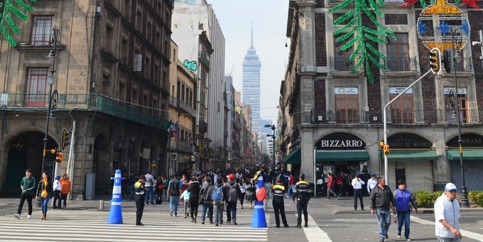    

## 1. “危”邦不入

我对墨西哥的认识主要来自于新闻及媒体。\
\
特朗普说: "They\'re bringing drugs. They\'re bringing crime. They\'re
rapists."\
\
中文媒体的报道也多把墨西哥渲染成"黑"西哥 -
黑社会，毒品，绑架，游客失踪。\
\
中国人讲危邦不入。\
\
开始做旅行计划时，我不假思索就把整个墨西哥 pass 了，更别提墨西哥城 -
这个西半球人口最多，面积最大，社会结构最复杂的超级大都市。让我后来改变主意的是一位暑期带全家畅游墨城的好友。她"无知无畏"的精神感动了我，激发起我强烈的好奇心和探险欲。\
\
关心我的同事劝我："哪儿不好去，非去这么不安全的地方？"\
\
我淡定回答："那边这么乱，我想去看看。"\
\
费城起飞的美国航空AA 497，经过5个半小时的飞行，
午夜时分抵达墨西哥城上空。\
\
从舷窗往下看， 墨西哥城 ，灯火通明。\
\
Tip(s)：\
1. 夜间抵达，住机场酒店。 如在 T1 落地，推荐和机场连为一体的Marriott。\
2. 过海关，保留入境卡。出境时，要交还。听说丢失罚款。\

图：平安夜飞临墨城上空

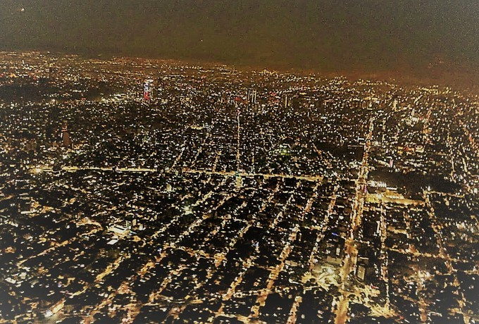  

## 2. 一房难求

墨城景点最集中的地方是历史中心区，中心区的中心是宪法广场（Zocalo）。\
\
但没想到圣诞期间游客这么多，广场周围的酒店爆满。\
\
我下手有点晚。\
\
朋友强烈推荐的Zocalo Central Hotel, 只订到28号一个晚上。\
\
另一个口碑很好的 Hampton Inn Suites， 也只订到25，26
两天，而且不是同一间。\
\
机场酒店留给到达的当晚24号， 和离开的前夜29号。\
\
剩下的一天，27号，给了历史中心区边缘的改革大道 Hilton Reforma.\
\
孩子他妈对我打一枪，换一个地方的安排颇有怨言。\
\
沟通在此时尤为重要。\
\
我好言相劝："你没听说这儿不安全？好多人都躲在酒店，不敢出门的。真那样，咱只住一地儿，多没意思啊。"\
\
她说："那我天天都得忙着跟着你们收拾。你又什么都不干！"\
\
我只能深情凝望孩他妈："我连危险都不怕，你还怕困难吗？加油！"\
\
Tip(s)：\
早做打算。\
\
图：改革大道希尔顿内景

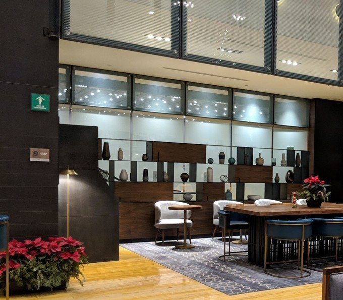  

## 3. 大教堂

宪法广场的北侧坐落着拉丁美洲最大的教堂 - 墨西哥大教堂。\
\
这是一座天主教堂。\
\
作为墨城的一个地标性建筑，它代表墨西哥在西班牙殖民时期的辉煌成就。曾经只有墨西哥上层人士才能进去祷告，如今开放给全社会，是观光者的必游之地。\
\
上世纪七八十年代，因地基下沉，钟楼倾斜，大教堂进入联合国濒危世界遗产名录。国际社会和墨西哥政府投入大量资金人力，及时挽救了这处历史文化遗产。\
\
教堂始建于1573年。\
\
西班牙殖民者攻占墨西哥城是1521年。当年的墨城叫做特诺奇蒂特兰，是中南美洲最大的帝国 -
阿兹特克帝国的首都。阿兹特克人已经在这里孕育出繁荣的文明。

殖民者与土著印第安人的战争异常残酷。西班牙人攻克特诺奇蒂特兰后，将整座城市夷为平地。50年后，他们在被推倒的阿兹特克人的神庙原址上面，用神庙的石头，开始修建这座大教堂。殖民者所要的不仅是形态的消灭，还有精神的征服。\
\
历时250年，大教堂竣工。不同时期的建筑大师使大教堂呈现出各个时代的建筑特征。其庄重的氛围，恢宏的气势，精美的雕刻，吸引来墨西哥及世界各地的朝拜者和游人。\
\
只是当朝拜者在里面祈祷时，有多少人会想到地下那些哭泣的亡灵。当游人感慨建筑的辉煌时，又有多少人叹息那消失的文明。\
\
图：夜晚的大教堂

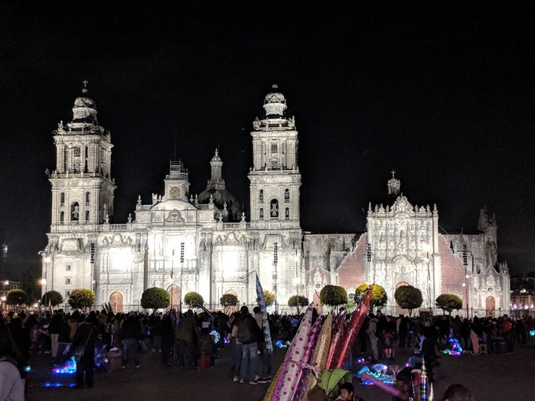  

## 4. 大神庙遗址

1978年，市政工人在地下两米处无意发现一块刻有女神雕像的巨石。随后展开的挖掘工作，带给考古学家巨大的惊喜。\
\
墨西哥政府拆除地上九座殖民时期的建筑，建成博物馆，将一个古阿兹特克的大神庙遗址展现在世人面前。\
\
大神庙紧挨大教堂，层层叠叠共有7层，是阿兹特克人祭祀战神和水神的地方。\
\
阿兹特克人本是北方的印第安游牧部落，一路打到如今墨西哥城的地方，当时尚是一片湖泊。在湖中心的小岛，他们看到一只苍鹰，口叼一条蛇，站立在仙人掌上。据传，这便是部落一直寻找的图腾。于是，阿兹特克人把此处定为首都，填湖造田，并取名特诺奇蒂特兰。\
\
阿兹特克人创建的文明，在教育，天文，建筑，艺术等方面都达到相当的成就。而宗教在他们的日常生活中占据重要地位。

神庙便是阿兹特克人祭祀的场所。但是，他们用活人做祭品，不仅数量庞大，而且手段异常残忍，残忍到会引起阅读的不适，此不赘述。为得到足够的祭品，他们随意挑起与弱小邻邦的战争，把大批战俘推上祭台。当西班牙人很容易就和当地少数民族部落结成同盟。\
\
殖民者暴力摧毁阿兹特克帝国，毁灭了一个文明，却让那些饱受欺凌的更加弱小的文明获得新生。\
\
如今，站在大教堂前，人们欣赏殖民时期的成就，却不愿多想殖民者的残暴。走在大神庙遗址上，人们叹息湮没的文明，却淡化它的野蛮。\
\
或许这就是人们在回望历史的时候，不能忽略的"历史局限性"吧。\
\
图：大神庙遗址

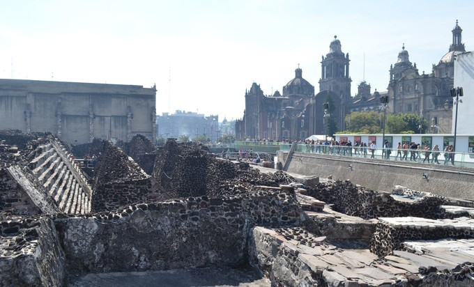  

## 5. 国家宫

墨西哥全称墨西哥合众国。国体类似美国邻居，实行三权分立。\
\
国家宫是联邦政府的行政中心，占据整个宪法广场东侧。\
\
总统名义上在此办公，实际上只在重大集会和活动时，才出现在面向广场的阳台，带头高呼
"墨西哥万岁"。\
\
国家宫的部分对外开放，游客凭证件换取入门卡。\
\
宫内是西班牙庭院式结构，很幽静，游人稀少。这要感谢工作人员，尽管排队入场的长龙已有几十米，他们既不加派人手，也不加快速度，依旧按部就班，不慌不忙，不紧不慢。

国家宫的看点是有"墨西哥的骄傲"之称的，壁画大师迭戈 - 里维拉的多幅大型画作。\
\
有种说法，你看懂里维拉在国家宫的壁画，就读懂了整个墨西哥的历史。\
\
值得一提的是，十月革命一声炮响，也给墨西哥人民送来马克思列宁主义。里维拉是一位墨共党员，虽然被开除了，但后来又入了，可见他不忘初心。而他创作的壁画，经常出现共产主义运动的元素。\
\
如果感觉图2上方眼熟，您没看错，他就是卡尔-马克思，正伸手为无产阶级指明方向，背后是一轮冉冉升起的太阳。\
\
Tip(s)：\
1.免费  \
2.人很多，队很长，要早来

图1，国家宫内一景\
图2，国家宫内大型壁画之一

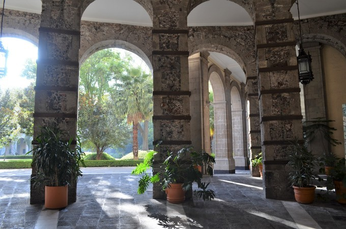

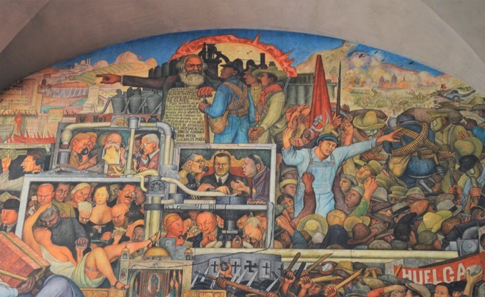   

## 6. 宪法广场

墨西哥是世界第15大经济体，在拉丁美洲排第2，仅次于巴西。\
\
首都墨西哥城堪称超级国际大都市，人口2100万（2015年数据），是全国政治经济文化中心，贡献全国一半的GDP.\
\
宪法广场是墨城的中心，国家的心脏。 墨西哥的重大历史事件都发生在此。\
\
广场的白天比较冷清。来的主要是两类人，游玩的，和游行的。\
\
这儿集中了国家行政中心和宗教中心，到此一"游"，喊声稍大一点，就能上达天听。

前阵子，宗教领袖和政府领导闹矛盾，大教堂在广场组织大型游行集会，抗议政府，反对堕胎合法化。\
\
可没过两天，女权主义者又占领广场，游行集会，抗议教堂，反对"反对堕胎合法化"。\
\
小时候听过一个相声，说天安门广场改自由市场了。在墨西哥，这个理想实现了！\
\
伴随夜幕降临，宪法广场开始热闹。小商小贩纷纷出摊，卖吃的，卖喝的，卖玩的，卖工艺品的，摊位布满广场四周，连个落脚的地方都难找。还有很多卖充气火箭的，在广场游走叫卖。小孩子们人手一个，使劲往天上扔，落地后，再拨开人群找。人声鼎沸，比自由市场热闹。\
\
广场中心有面巨大的国旗，展开有几十米。网上说升降旗也是一景，我就挤进去，趴栏杆上看。等天黑透了，我都快睡着了，也没人来降旗。再上网查，人家还说，哪天升降，啥时候升降，没准儿。主要看运气。

图1，广场白天\
图2，广场傍晚

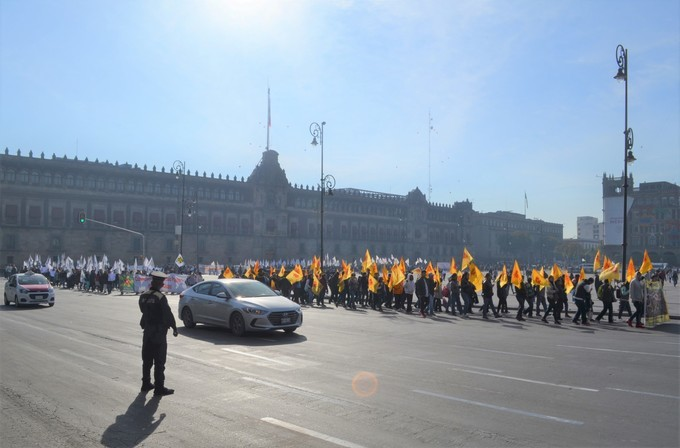

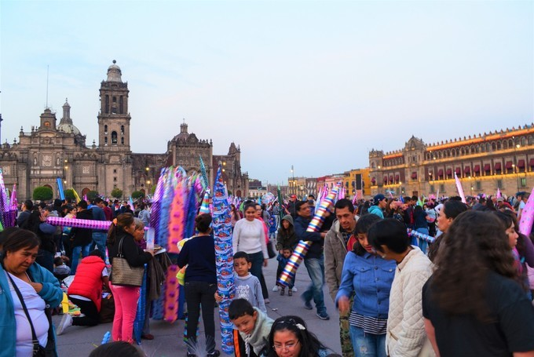   

## 7. 步行街

宪法广场周边统称老城区，街道纵横交错，商业网点密布。\
\
其中最著名的是马德罗步行街，在广场正西，约800米短，没走几步就到头，头上是拉丁美洲塔。\
\
街道不宽，很干净。两旁建筑很欧式，明显殖民时期的产物，有教堂，旅馆，商店，餐厅等。\
\
各类街头艺人很忙，沿街吹拉弹唱变魔术。 墨西哥人民似乎不忙，这边锣鼓点一响，好多人就围过来，里三层外三层，开心看半天。\
\
步行街人很多，拥挤程度不亚于北京王府井， 上海南京路，连过马路都很像。机动车虽不能上步行街，但可以穿过。有警察在路口吹哨。哨声一响，两边等待过马路的大军便齐步走，蔚为壮观。\
\
天黑后，人更多出几倍，更拥挤。卖艺的下班了，卖小吃的出摊了。卖爆米花的，炸芭蕉的，棉花糖的\...
最多的是卖煮玉米的，捞出来后，撒一层cheese，再蘸一圈辣椒面，插在一根"筷子"上。连一些衣着光鲜的靓女，都边走边啃得津津有味。

有的摊主，边卖边眼观六路。卖到一半，突然不卖了，推起炉子，撒丫子就跑。往旁边一看，穿制服的"城管"追过来了。\
\
图1，步行道街景 \
图2，拉丁美洲塔俯瞰艺术宫

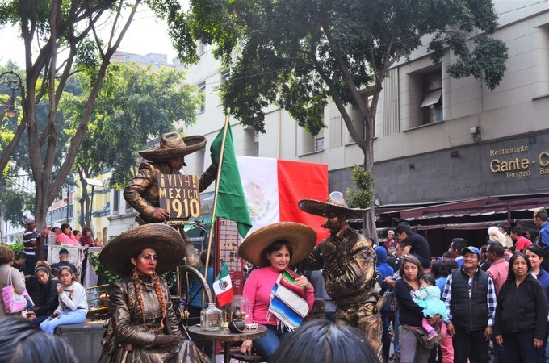

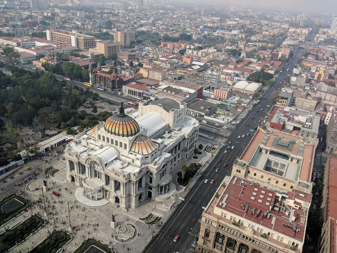   

## 8. 艺术宫

向西，走出拥挤的步行街，便置身拥挤的艺术宫广场。\
\
艺术宫建成于1934年，集宫殿，音乐厅，艺术中心于一体。白色大理石的建筑颇具气势，
橘黄色穹顶在阳光下熠熠生辉。\
\
本想在这个艺术殿堂看场高水准的演出，可惜节日期间艺术家们也休息。只好在烈日下排队45分钟，买票参观。\
\
宫内陈列多幅世界名画。最著名的是三楼大厅的迭戈-里维拉的壁画"十字路口的人类"。\
\
这幅画原本是里维拉应邀为纽约洛克菲勒中心创作的。但画中对马列主义的表现，引起洛克菲勒不满。里维拉拒绝做出改变。 洛克菲勒于是付全款后终止了和里维拉的合作。在洛克菲勒中心，壁画先是被遮挡，第二年被铲除。\
\
事件引起美国社会广泛的关注和争论，争议的层面最终上升到社会道路的选择，艺术的功能，和艺术家的权利。\
\
愤怒的里维拉回到墨西哥，在艺术宫重新创作了这幅伟大的作品。\
\
时代变迁，世事更迭。不同的时期，不同的社会，人类会面对不同的问题，却都面对"人类向何处去"的相同的拷问。\
\
图1， 艺术宫\
图2， "十字路口的人类"的中间部分。约为整幅画的三分之一。画中人物有列宁。

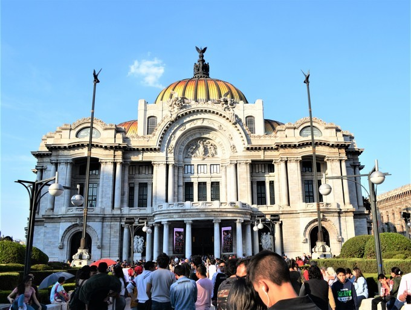

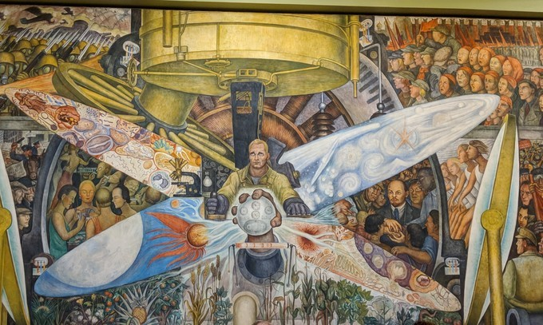   

## 9. 托洛茨基

壁画大师里维拉的作品中经常出现的一个人物是托洛茨基。\
\
在世界绝大多数共产党执政的国家里，"托（洛茨基）派"份子意味政治生命的死刑，再无出头之日。\
\
那么托洛茨基及其一派又是什么洪水猛兽？\
\
十月革命炮响时，托洛茨基是红军的总司令，具体的组织者和领导者，被誉为苏联红军之父。在建立和保卫苏维埃的战争中，托洛茨基转战各个战区，出生入死，立下卓越功勋，被称为"钢铁的灵魂"，在苏共享有仅此于列宁的地位。\
\
列宁去世后，托洛茨基和斯大林在对马列主义的继承和发展上出现分歧。斯大林认为"一国可以建成社会主义"，托洛茨基不同意，主张世界范围内的"不断革命论"。\
\
与斯大林的权力斗争落败后，托洛茨基由"钢铁的灵魂"变成"人民的敌人"。托派的世界革命论本为极左，却被定为"形左实右"。斯大林大肆围剿托洛茨基一派。风暴蔓延至中国和其他社会主义国家，把政治对手打成托派份子成为权力斗争的杀手锏。\
\
托洛茨基被开除党籍，流放，驱逐出境。\
\
里维拉在苏联结识托洛茨基，成为挚友。他利用自己的影响力，从中斡旋，让墨西哥政府接受托洛茨基来墨定居。\
\
在墨城居住期间，托洛茨基积极着手成立第四国际，对抗斯大林在国际共运的地位。他多次躲过苏联特工暗杀。墨政府遂加强对他的保卫。\
\
1940年，一名神秘的西班牙男子赢得托洛茨基女秘书的芳心，并借机出入托宅，进而取得托洛茨基的信任。在一次只有两人在场时，他假意请托洛茨基修改文章，抽出藏匿的冰镐，瞄准头部，给出致命的一击。\
\
这位无产阶级革命家，军事家，理论家，十月革命的领导者，叱咤风云的红军统帅，没在枪林弹雨中倒下，却终没逃过"同志们"的追杀。\
\
图1， "十字路口的人类"的部分。画中的托洛茨基，马克思，恩格斯。\
图2， 担任苏联红军总司令的托洛茨基。画作亦是艺术宫的展品。

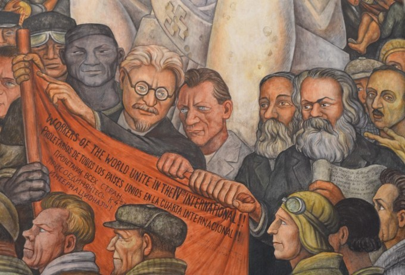

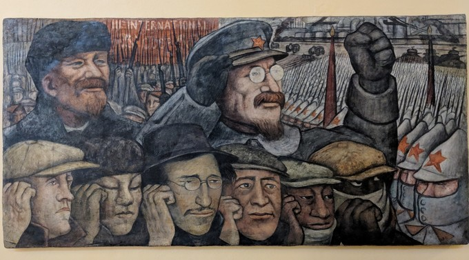   

## 10. 特奥蒂华坎

（上）\
\
自发现之日起，特奥蒂华坎就笼罩在神秘之中。\
\
这座距墨城约40公里的古城，是古印第安文明的重要遗址。据考古学家研究，它始建于公元前100年，相当于我国秦朝的年代，在之后的几百年间，特奥蒂华坎发展成为拥有15至25万人口的大都市。其宏伟的金字塔群，排列整齐的建筑，宽敞的大道，让当今世人叹为观止。然而，在公元700年前后，仿佛一夜之间，城市被遗弃，人去楼空，如此灿烂的文明消失了，突然，又神秘。\
\
人类再次踏上这片土地，是大概600年后。阿兹特克人到来时，这里早已是一片废墟。惊叹于建筑的辉煌，宫殿的华丽，城市的规模，阿兹特克人给城市取名"特奥蒂华坎"，意为"众神之城" -
只有众神才能创造出的城市。\
\
如今人们看到的只是当年城市的十分之一。另外的十分之九尚待发掘。然而，科学家通过电脑还原特奥蒂华坎原貌，发现其城市设计即便与今天的世界大都市相比，亦毫不逊色。\
\
特奥蒂华坎留给世界太多的谜团：是什么人创建这座众神之城？他们说什么语，长什么样，从哪里来，又去了哪里？\
\
（下）\
\
访问特奥蒂华坎最简单的方式是跟团。\
\
我们因计划去遗址附近的洞穴餐厅吃饭，决定自己坐旅游车去。墨城北站的旅游车每隔20分钟出发，非常方便。\
\
特奥蒂华坎最著名的金字塔是太阳金字塔和月亮金字塔，均为祭祀场所。太阳金字塔还是世界第三大金字塔。\
\
金字塔修有台阶，可以攀爬，但有的地方十分陡峭，目视有七八十度。尽管借助绳索，孩他妈爬到顶时，仍脸色煞白，几乎倒不过气来，很惊悚。\
\
我们早晨十点左右到的，人还不是很多。下午离开时，等待上塔的人在下面足足排了100多米的长队。通往塔顶有个等待区，早晨空无一人，下午挤的满满的。\
\
景区有很多卖纪念品的当地小商贩，都会说中文："便宜，便宜"。他们卖的比较好玩的是模仿老虎等动物叫的一种陶器。声音逼真，一出声，冷不丁吓人一跳。\
\
3点左右，我们来到洞穴餐厅。原想这个时间已过饭点，结果还是要等50分钟才有座位。网传5点以后，遗址附近不安全，只好作罢。\
\
[去特奥蒂华坎的那天是阴天，我们就没涂防晒霜，犯了大错。 墨西哥高原紫外线强烈，鼻头都被晒脱皮，脸部及身体暴露的地方，更逐渐变成棕色。感觉后面的两天我们都成了阿米哥。\
\
图1，从月亮金字塔拍摄景区，中间大道叫做亡者大道，远处为太阳金字塔\
图2，洞穴餐厅

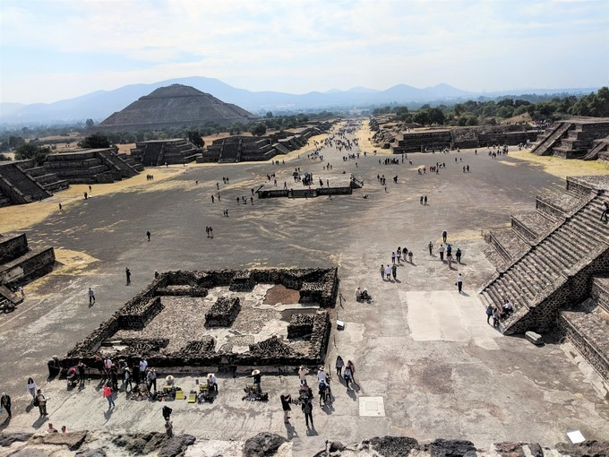

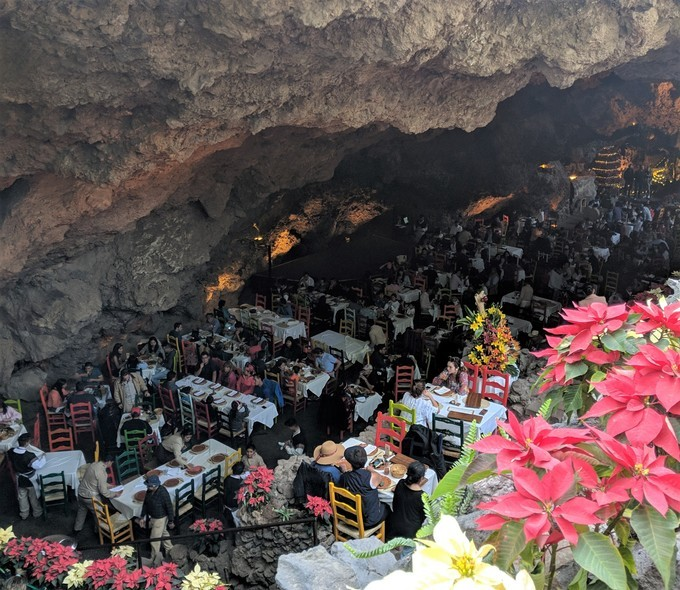   

## 11. 蓝房子

10点种开门。然而8点开始，来参观的人便络绎不绝，排起长队。我们中午到的，被工作人员告知，当日票已售罄。\
\
蓝房子的正式名称是弗里达- 卡洛博物馆，是墨西哥著名超现实主义先锋派女画家弗里达- 卡洛的故居。\
\
弗里达出生在一个父亲是德裔犹太画家和摄影师，母亲是西班牙和印第安混血的家庭。她6岁患小儿麻痹，已属不幸；18岁又遇致命车祸，颈椎断裂，脊椎断裂，右腿严重骨折，右脚粉碎性骨折，扶手穿进腹部。没人能想到，经历数十次手术后，她竟活了过来，并开始用画笔记录人生和情感。\
\
她的画色彩浓烈，寓意深刻，有强烈的视觉冲击感，成为法国卢浮宫收藏的第一副墨西哥现代画家的作品，受到毕加索等人的称赞。\
\
作为一个身残志坚，无比励志的正能量典型，故事应该到此结束。但作为真实的人，她内心深处充满痛苦与挣扎。\
\
"我一生遇到两大不幸，一是车祸，一是里维拉" - 弗里达\
\
里维拉就是那位墨西哥杰出的壁画大师，既是她的老师，又是她的丈夫，比她大二十岁。\
\
老一辈革命家多风流人物，艺术家的情史更源远流长，而里维拉身兼革命家和艺术家，红颜知己，不计其数。\
\
深爱丈夫的弗里达，一忍再忍，等到忍无可忍，便红杏出墙，展开报复。她出轨的既有异性，也有同性，既有艺术家，也有政治家。苏共领袖托洛茨基来墨西哥后，一直住弗里达家里。两人发生关系后，托洛茨基搬出蓝房子。\
\
在发现丈夫与自己的妹妹有染后，弗里达终于提出离婚。然而，分开后的两人却发现对方是不可替代的精神伴侣，于是很快复合。\
\
饱受情感折磨的弗里达，此时身体状况每况愈下。她不得不截肢右腿下部。她被迫换上辅助脊椎的钢制矫正衣，箍在身上像冰冷的钢圈。她的代表作 -
自画像 The Broken Column，便是那时创作的，传递出画家无以言状的"痛"。\
\
在疾病的煎熬中，弗里达的忍耐达到极限。她说："我不要被埋葬，我已经躺太久。烧了我
!"\
\
逝世前几天，在最后一篇日记中，她写到："I hope the exit is joyful and I
hope never to return. " (唯求一路走好，但愿永不再生）（自译）\
\
那年，她47岁。\
\
图1，旅游车路过蓝房子。上面是弗里达的画像。\
图2，弗里达自画像 The Broken Column （图片取自网络）

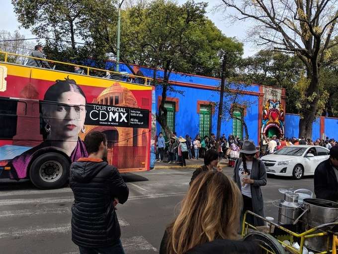

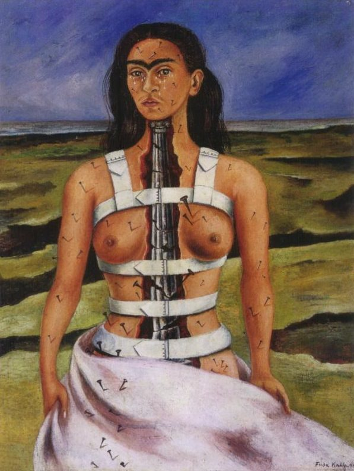

## 12. El Cardenal @ Hilton Reforma

El Cardenal 是墨西哥城非常 Popular 的一家餐厅，尤其是它的 Brunch.\
\
选择在改革大道Hilton酒店住一晚，部分原因也是因为El Cardenal
就在酒店的一层， "近水楼台"。\
\
早晨10点左右，我一人先下楼，"考察"餐厅情形。人多的出乎意料。诺大的餐厅爆满，门口还有大批人等座位。到前台登记，服务员说需要等一小时。\
\
回房间和大家商量是去博物馆呢，还是等吃饭。女儿说不管，"really don\'t
care"。儿子坚决要吃饭！\
\
餐厅的甜点确实很好吃。松软醇香，而且不很甜，适合我们的中国胃。看到很多人来这儿只买一盒甜品带走。\
\
咖啡，热巧克力味道很浓，很纯正，散发迷人的香气。\
\
主菜各具特色，但都很" 墨西哥"。我点的牛舌taco，味道不一般，有点辣，有点酸，酸辣之中还带点膻。更怀念中国的卤味。\
\
儿子点的牛排很好，肉嫩，多汁，外面却很焦脆。\
\
图1，餐前点心\
图2，正餐

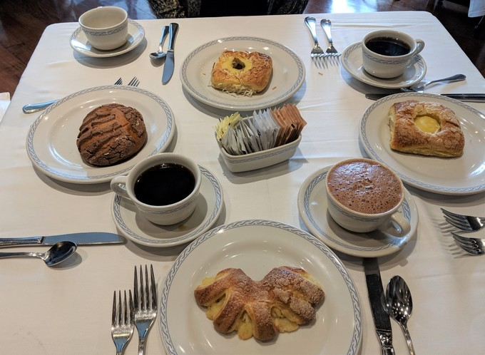

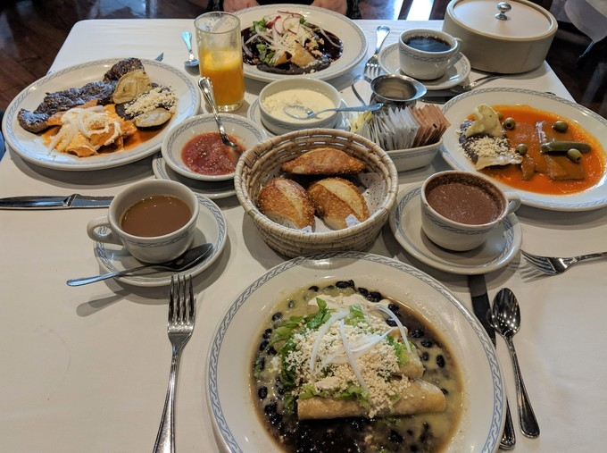   

## 13. 查普尔特佩克城堡

美洲大陆唯一的皇家城堡。\
\
名字不大好记。直到我把它记成" 普洱茶特配我"，才基本搞定。\
\
美国内战期间， 墨西哥也在战乱之中。 法国武装干涉墨西哥 ，支持保守派恢复帝制，颠覆自由派拥护的共和制。\
\
保守派取得阶段性胜利后，生于欧洲奥地利美泉宫的皇室成员马西米连诺在墨西哥称帝。其兄是当时的奥地利皇帝，其嫂便是著名的茜茜公主。\
\
马西米连诺在郊外的查普尔特佩克公园建起这座城堡，作为皇宫，又修了一条通往市区的皇帝大道，即今天的改革大道。大道上有个不错的希尔顿酒店，但这不是广告。\
\
好景不长，只三年时间， 共和派扭转战局。此时， 美国内战也结束，老美腾出手来，出钱出兵出装备，支持共和 。\
\
共和派重新夺回墨西哥城，逮捕马西米连诺。尽管遭到包括美国在内的国际社会强烈反对，墨西哥政府仍以颠覆国家罪判处皇帝死刑。皇帝在行刑前，与执行枪决的士兵一一握手。最后，面向行刑者，指着自己胸膛，高呼"为国家利益，我甘洒热血。
墨西哥万岁！独立万岁！"\
\
墨西哥从帝制走向共和 ，城堡从皇宫变成总统官邸。历经8任总统后，城堡以博物馆的形式向公众开放。\
\
城堡所在的查普尔特佩克公园，被称作墨西哥城的肺，面积很大，景色和其他城市的公园相比，并无多大不同。\
\
公园内卖东西的小商贩很多。女儿一直想尝试图3那种桔黄色的小食品，就买了一个。咬一口才知道，是墨西哥"话梅"。我也尝了，真酸！酸得前所未有，眼泪直流。行文至此，舌下涌出一股酸水。\
\
公园厕所都是旋转门，无人值守，但需要投币。儿子好奇，就去了，完事回来说4个比索（约20美分）一位。但墨城地铁票才5比索。我说："小便一分钟，地铁十里地。孩纸，你是在炫富吗？"\
\
图1，城堡.\
图2，在露台眺望墨西哥城\
图3， 墨西哥"话梅"

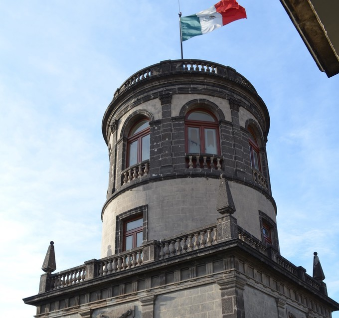

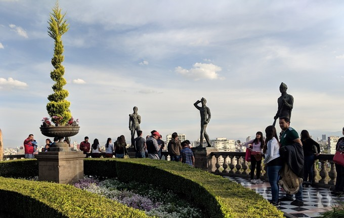

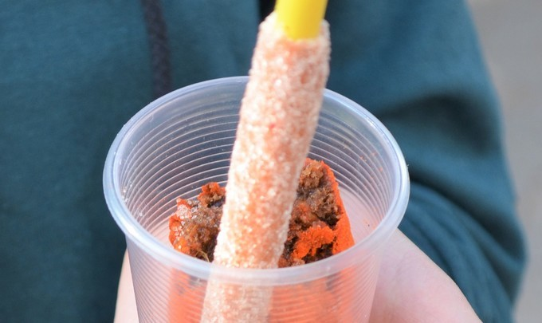   

## 14. Zona Rosa 

独立天使纪念碑位于改革大道的一处街心环岛内。天使右手高举象征和平的橄榄枝桂冠，左手紧握断开的锁链，象征墨西哥人民砸断殖民枷锁。\
\
改革大道被称作墨城第一街，地位相当于北京的长安街，长约30公里。两侧绿树成荫，高楼林立。每逢周日，机动车被禁止通行，道路仅供市民骑车，跑步，健身使用。春节期间，当地华人还会在改革大道舞龙舞狮。\
\
面向天使，改革大道的左侧，便是墨西哥著名的餐饮区 Zona
Rosa。在西班牙语中，Rosa
有玫瑰和粉红双重意思，所以在中文语境里，这片区域被称作玫瑰区或粉红区。\
\
说是餐饮，其实有点Misleading，主要是各类酒吧。节奏强烈的流行音乐响着，成年男女，三三两两，吞云吐雾，大块吃肉，大口喝酒。\
\
我们转了半天，才找到一家安静的面向家庭的餐厅。里面有乐队演唱墨西哥民谣。我先点杯啤酒，热热身。然后要了杯龙舌兰。龙舌兰是墨西哥国酒，度数高，没有中国白酒的酱香或浓香，味道很清，但很烈。\
\
主菜中，孩他妈点的虾在色香味上力拔头筹，被全家公认最佳。儿子点的最差，除他外，没人愿意品尝一下，整个就是一美国炸鸡排。我喜欢我的牛油果肉粒Taco。\
\
饭后大家决定散步回酒店。\
\
改革大道，华灯初上，夜色阑珊。我们从玫瑰区走进玫瑰夜\...
，可惜后面跟俩孩子，一点都不浪漫。\
\
图1， 独立天使纪念碑\
图2，餐厅乐队在表演\
图3，历史中心区的唐人街

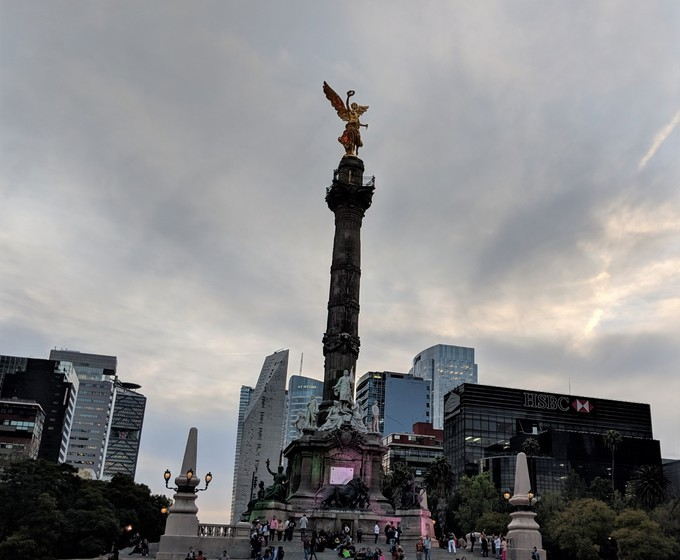

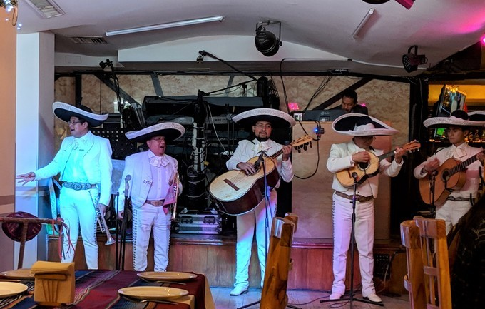

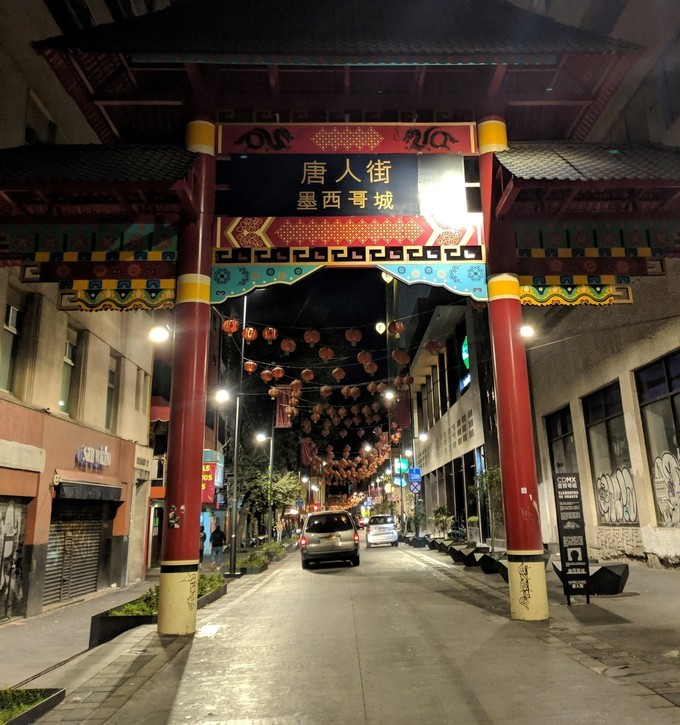    

## 15. 索玛雅博物馆

福布斯财富榜2010 - 2013
的世界首富不是盖茨，不是巴菲特，而是一位名叫Carlos Slim 卡洛斯 斯利姆的墨西哥企业家。\
\
他生活俭朴，打着廉价领带，在墨西哥城一住38年也不换住所。\
\
但晚年他却做出一个壮举，出巨资修建了这座艺术博物馆，轮流展出他收藏的6万6千多件世界范围的艺术品，包括雕塑，绘画，实物等。他收藏的法国雕塑大师罗丹的作品之多，仅次于法国本土。为纪念教他艺术鉴赏，已过世的爱妻 Soumaya（索玛雅），他将博物馆命名为索玛雅博物馆。为让热爱艺术的普通墨西哥人都有机会欣赏大师们的作品，他令博物馆免费接待游人。\
\
进博物馆也要排十几分钟的队，但里面的人流不算大。不冷清，也不拥挤，正适合观赏艺术品。\
\
有幸赶上中国的象牙雕刻展览，我们饶有兴致地看到乾隆，关公，花木兰 ，林黛玉，观音菩萨，弥勒佛，八仙过海等熟悉的人物雕刻，个个形象生动，工艺精湛，令人回味无穷。\
\
墨西哥著名的建筑师 Furnando Romero 设计了这座造型酷炫的博物馆，灵感来自于风帆。他还是卡洛斯和索玛雅的爱婿，陪太太回娘家也不忘和老丈人谈谈设计理念和进展。\
\
图1，索马雅博物馆外观\
图2，博物馆内的中国象牙雕刻

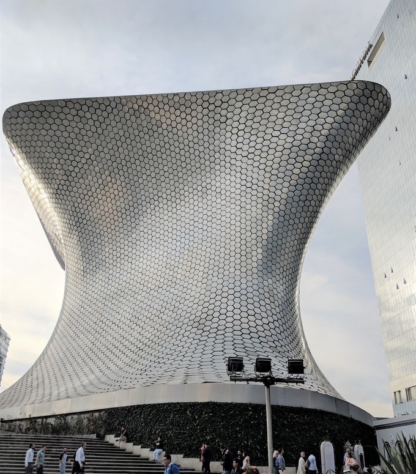

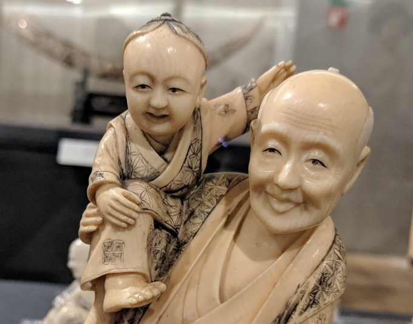   

## 16. Polanco

索玛雅博物馆所在的区叫 Polanco，是墨西哥城最高端的社区。超级富豪，政治人物，明星，艺术家，富商云集于此，素有墨西哥城的
Beverly Hills 之称。\
\
索玛雅博物馆紧挨着一个大Mall. 进门便看到纽约第五大道的奢侈品店 Saks
Fifth Avenue. 里面包罗Prada, Hermes, Gucci 等一众国际大牌。\
\
我们在咖啡厅小憩片刻，傍晚时分，开始沿街道走走看看。很多跨国公司在墨西哥或拉丁美洲的总部都设在Polanco.
沿途高楼林立，车水马龙。与其他国际大都市不同的是，HUAWEI
的手机充电桩随处可见。\
\
虽然此地（据说）很安全，但离我们住的历史中心区比较远，所以天刚完全黑下来后，我们便叫车回酒店了。\
\
图1，Polancho 区的一角\
图2，Mall 里的奢侈品店

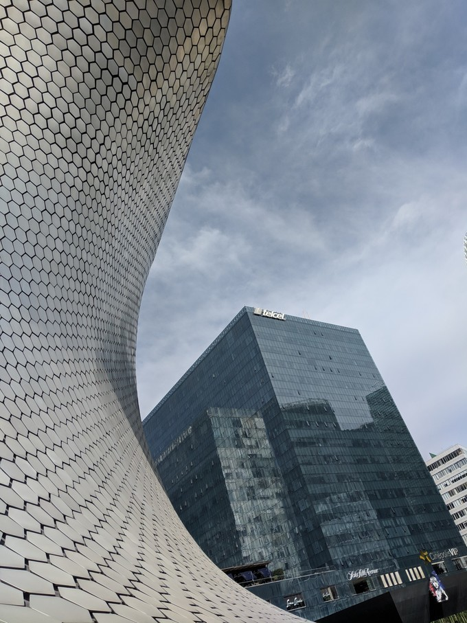

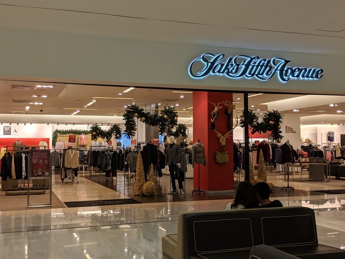   

## 17. 奥运盛会

2018 适逢墨城奥运成功举办50周年，当地举行大型庆祝活动。\
\
半个世纪前，在战胜美国底特律，法国里昂，阿根廷布宜诺斯艾利斯后，墨城取得第19届奥运主办权。\
\
无人料到，在这个海拔2300米，空气含氧量比平原低30%的高原之城，诞生数个奥运"第一"。\
\
第一次在第三世界国家主办。\
\
第一次在拉丁美洲举办。\
\
第一次参赛国家超过100。\
\
第一次进行性别和药物检查。\
\
第一次选手采用革命性的"背越式"跳高并获得冠军。\
\
第一次运动员突破百米10秒，两百米20秒大关 。\
\
第一次跳远运动员跳出光学仪器测量范围，裁判员必须用卷尺测量，结果超出世界纪录55厘米。\
\
第一次华人女性获得奥运奖牌，纪政代表中华民国获得80米跨栏铜牌。\
\
等等。\
\
然而最让人感动的标志性人物却是来自非洲坦桑尼亚的马拉松选手 Akhwari.\
\
比赛初期便跌倒受伤，但他坚持不退赛。颁奖典礼结束了，组委会才惊讶得知有个运动员还在跑。他一瘸一拐，比常人更慢。记者也问他比赛都结束了，为什么还要跑。他说"My
country did not send me 10000 miles just to start the race; they send me
to finish the race.
（我的祖国把我从万里之外送到这里，不是让我开始比赛，而是要我完成比赛）"\
\
记者把消息发回新闻中心，消息很快通过广播传到千家万户。回家的市民又纷纷来到路边，为他加油助威。 天全黑了，体育场为他一人重启灯光，照亮跑道。他披星戴月，拖着伤腿，几乎是挪过终点线。\
\
取得巨大成功的墨城奥运，然而在开幕10天前却差点夭折\...\...\
\
图：艺术宫前的墨城奥运会徽

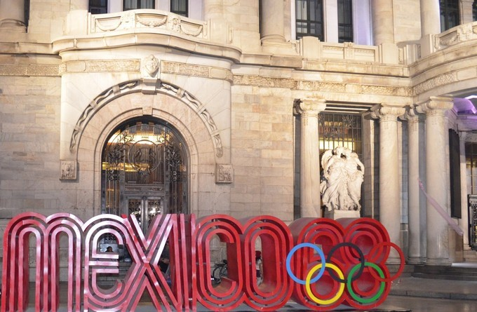   

## 18. UNAM

墨西哥国立自治大学，缩写为
UNAM，是墨西哥最著名的高等学府。"自治"的含义是学校独立于墨西哥政府，课程设计和财务管理不受政府制约和干预，享有完全的学术自由。\
\
该校培养出3位诺贝尔获奖者，6位墨西哥总统，包括世界首富卡洛斯-斯利姆在内的一批企业家，和众多科学家，艺术家，作家及运动员。\
\
1968年，这个世界的多事之秋，对 UNAM
注定不寻常。学校体育场被指定为奥运主会场。而诞生在校园的一场史无前例席卷全国的学生运动，却几乎夭折这届奥运。\
\
60年代，墨西哥经济以6%的增长率持续飞速发展，世称"墨西哥奇迹"。墨政府投巨资办奥运，急于向世界展示成就。但经济发展的宏利没有公平的落到普通百姓身上，导致社会财富分配不公。学生们认为解决国内各种问题更紧要。\
\
然而学生们的抗议均被政府打压。8月的一天，墨西哥国立自治大学的校长带领5万学生走上街头，高呼"不要奥运，要革命"的口号，抗议政府施暴，反对专制，要求民主。其巨大的号召力和影响力，使发生在首都的学生运动迅速波及全国。\
\
国际奥委会警告墨政府，如果局势得不到控制，奥运将改在美国洛杉矶举行。\
\
10月2号，离奥运开幕只有10天，学生运动持续高涨，万名学生和市民举行集会。下午6点左右，墨政府出动军队，装甲车，卡车，包围集会广场。在直升机的配合下，政府军向手无寸铁的群众开枪。遇难人数至今不详，说法从数十到数百，史称特拉特洛尔科（广场所在地区）大屠杀。\
\
事件发生后，墨政府的官方解释是：隐藏在学生中的少数坏人向政府派来的安保力量开枪挑衅，激起军队的还击。政府控制的媒体统一口径报道了官方的版本。奥运如期举行。\
\
青山遮不住。30年后，真相逐渐浮出水面。当年墨政府一手策划惨案。时任内政部长在84岁高龄被逮捕，并以种族屠杀罪被起诉。\
\
40年后的2008年，墨政府把10月2日法定为国家哀悼日。\
\
如今，在事发地三文化广场立起一座纪念碑，在最高法院浮起一面纪念壁画。\
\
墨西哥国立自治大学，美丽而安静。50年前从这儿诞生的学生运动虽被镇压，但开启了之后30年墨西哥人民反对专制的抗争，并终于建立起民主的政府。\
\
学校的标志性建筑，中央图书馆的壁画为里维拉和其他著名大师联袂创作。\
\
大学校园，因各类建筑极具特色，且多出自大设计师的手笔，被联合国教科文组织列为世界文化遗产。\
\
图：墨西哥国立自治大学的中央图书馆

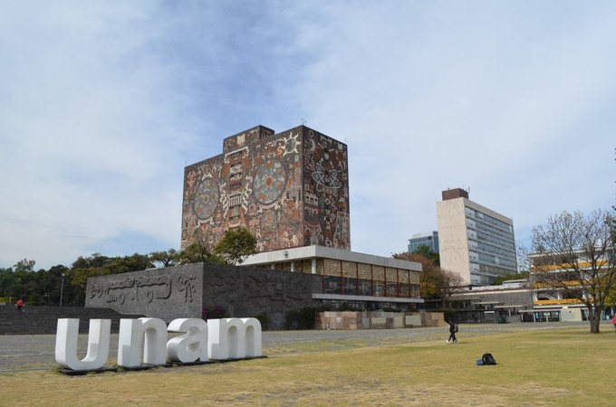    

## 19. 敢做敢"吃"

中印法意墨 -
世界五大菜系，其中的墨西哥菜以味道浓烈，色彩绚丽闻名。其食材包罗万象，五彩缤纷，和我中华泱泱大国有一拼。\
\
墨西哥人民最爱的taco，形式简单，内容丰富。来前都是吃的美国版，一张小薄饼卷点牛肉或鸡肉。来后发现，"馅儿"的内容多种多样，富有内涵。\
\
首先，牛羊猪鸡肉都是现烤现切，很有家乡"撸串儿"的味道。\
\
另外，海鲜taco也不稀罕。\
\
入"馅儿"的还有炖肉，肉皮，猪头肉，羊蹄筋，牛百叶，牛舌等等，非常接地气。但蝗虫/蚂蚱馅儿，要想吃，还需要多点勇气，得先迈过心理障碍这道坎。\
\
我对待吃的态度一向是，你敢做，我敢吃。可惜蚂蚱卷没留下什么特殊印象，略感失望。\
\
真正留下难忘印象的是牛排\...里的青辣椒。\
\
都说墨西哥辣椒辣，比不上我们家辣妹子辣。父母都是湖南人，孩他妈基因就带仨字：不怕辣。\
\
而且这两只青椒，看着绿绿的，挺柔和。\
\
我先尝一小口，还好，就推荐给孩他妈，顺便奉承一句："凭您的水平，两口拿下"。她轻蔑看眼辣椒，随口咬下半只。\
\
没想到这辣椒后劲十足，越嚼越辣。我赶紧吐出那一小口，嘴里却还有一团烈焰燃烧，半杯冰啤没压住。\
\
再看孩他妈，因为脾气急，半只已经咽下，此时悔之晚矣，火在胸中烧，泪在脸上流，不住拿手往嘴里扇，呼唤"水，水，冰水"。在辣椒面前，她表现出前所未有的不淡定。\
\
情绪稳定后，她说的第一句话是："头皮都麻了"。\
\
奉劝云贵川湘的朋友们，不要看不起墨西哥小辣椒，人家是有尊严的。\
\
图1，蝗虫 taco\
图2，牛排中的小辣椒

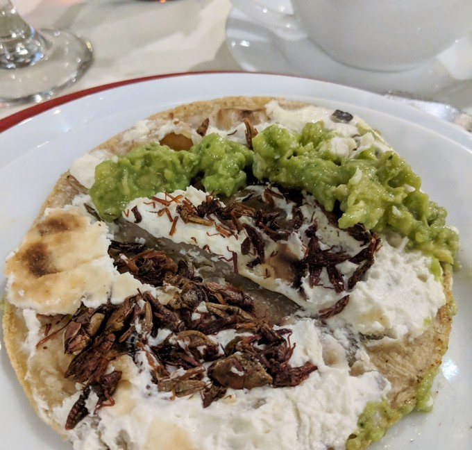

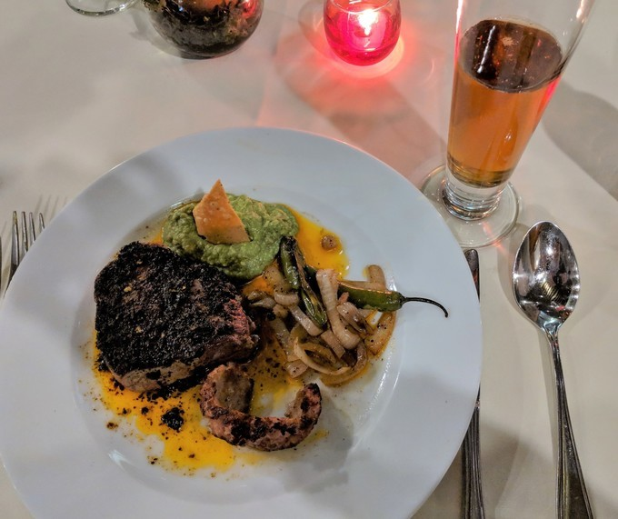    

## 20. 人类学博物馆

人们都说，墨西哥国立人类学博物馆才是墨城第一景点，珍藏大量古印第安文化遗产，跨越几千年，不仅在拉美，在世界同类博物馆中也极负盛名。\
\
意义如此重大的人文景观，拖到最后才（不得不）写它，实在觉得自己没文化。写不出来，又不能跳过，否则就坐实了。硬着头皮写几句吧。不对之处，各位看官别笑话。\
\
人家说，太阳石乃博物馆镇宅之宝。它是阿兹特克文明最有影响的遗存。早期的各路学家把它立起来研究，得出"伪"结论 -
它是日历。后来的学家把它放倒了科研，得出结论 -
它是祭台，用于祭品的宰杀。\
\
俺没文化，就点头附和: "您说是啥就是啥。"\
\
人家说，
奥尔梅克巨石堪称大馆重器。它是3000年前奥尔梅克部落印第安人的杰作。雕刻的头像阔鼻厚唇，有典型的非洲人特征，旁证了地球人类起源于非洲的说法。\
\
俺没文化，但听懂了: "全世界人民是一家。"\
\
人家说，
27个精心布置的展厅，陈列玛雅，阿兹特克，奥尔梅克，特奥蒂华坎，特尔特克等古印第安文明的数万件展品。徜徉其中，仿佛穿越在各个时期各个地域的印第安文明。每件展品都在说话。\
\
俺没文化，就知道："东西好多，馆好大！"\
\
图1，博物馆内景\
图2，阿兹特克太阳石\
图2，奥尔梅克巨石

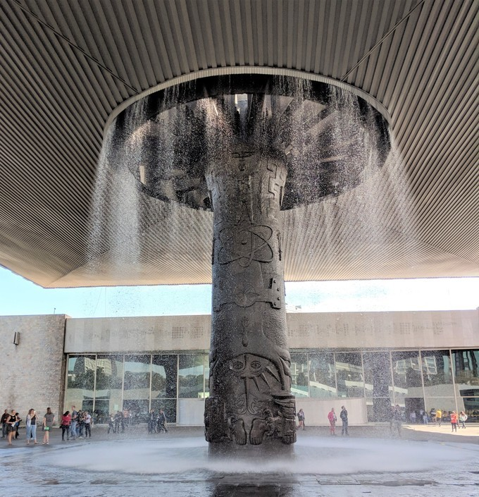 

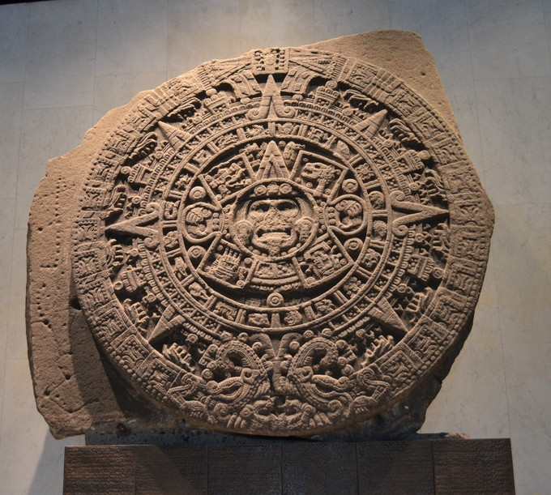

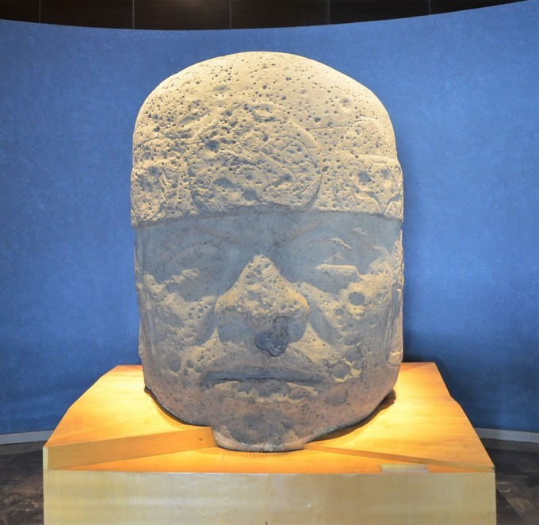    

## 21. Zocalo Central

有比较才有发言权。\
\
墨城之旅的酒店都是我订的，不错那是自然，但朋友推荐的这家 Zocalo Central
尤其赞。\
\
我们傍晚到达。\
\
刚进大堂，工作人员就递上一杯"龙舌兰"。我一边登记，一边"走着"，感觉好极了。\
\
酒店位置极佳，紧挨宪法广场。外面热闹异常，里面别有洞天，色调很 cool.\
\
惊喜持续到房间，桌上摆放着感谢卡，巧克力，酒和酒杯\...，顿感宾至如归。\
\
酒店的餐厅很有名，需要提前预订。我忽略了。带全家过去晚餐时，带位小姐说干等的话，吃上恐怕得11点以后了。我说我们中国把那叫夜宵。\
\
次日大早，我迫不及待又去了。不是馋那一口。是起早了，赶去广场看升旗，那面25米
x 14.3米的巨幅国旗。\
\
天刚蒙蒙亮，可旗已经在旗杆上。我十分不解，就问警察，回答是昨晚压根没降。我说你们对待国旗都这么随意吗。\
\
为缓解胸中的郁闷，这才直奔餐厅。\
\
找个靠窗的位置坐下，品着浓浓的墨西哥咖啡，我看大教堂，看国家宫，看远山，看远山升起太阳，把周围的一切照的金黄。\
\
图1，酒店 lobby\
图2，餐厅观日出\
图3，餐厅内景

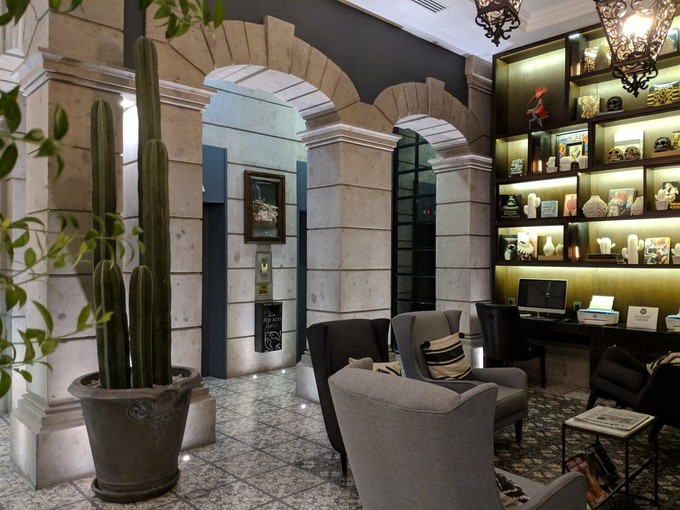 
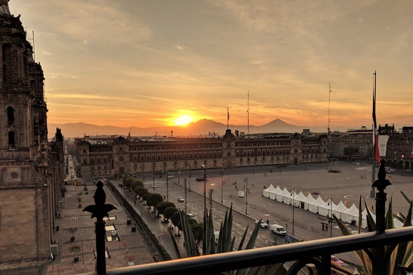 
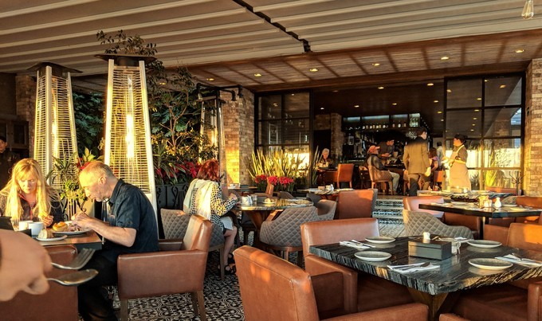    

## 22. 墨西哥，再见

墨西哥城，一座古老和现代交汇的城市。短短几日，我们在此领略了墨西哥久远厚重的历史，璀璨绚丽的文明，和多姿多彩的文化。\
\
如果您对神秘的印第安文明抱有浓厚兴趣，那么墨西哥是您不二的选择。\
\
我们的具体行程，整理如下，供您参考：\
\
D1, 飞墨西哥城 。\
D2, 宪法广场，大教堂，马德罗步行街， 拉丁美洲塔\
D3 日月金字塔\
D4 人类学博物馆，查普尔特佩克城堡，天使纪念碑及玫瑰区，Alameda公园\
D5，蓝房子，科约坎市场， 墨西哥自治大学，索玛雅博物馆及 Polanco\
D6，国家宫，大神庙遗址，艺术宫\
D7，飞回美国\
\
注：有的景点只是点到而止。\
\
Tip(s)：\
1. 博物馆在节日闭馆。\
2. 除自由市场，感觉哪哪儿都排队。早出发，先去人多的地方。\
3. 出行用Uber。\
4. 安全第一, 相信直觉。\
\
最后，感谢我朋友圈的亲们一路围观评论，鼓励点赞，当然少不了戏虐调侃，"朋友虐我千百遍，我待朋友如初恋"，你们开心是我发帖的源泉。\
\
也感谢读到此处的新朋友们，感谢你们坚持看完，心疼你们。\
\
是时候说再见。\
\
让我用两位"相爱相杀"相识25年+的朋友留言结束全篇：\
\
"看完你详尽的游记，果断觉得这地方真不好玩，不用去了，真是省老钱了，万分感谢！  \
\
"\[捂脸\]\[捂脸\]啥态度呀，地方还是好的，就是写书的有点啰嗦。"\
\
墨西哥，再见，我很抱歉。

